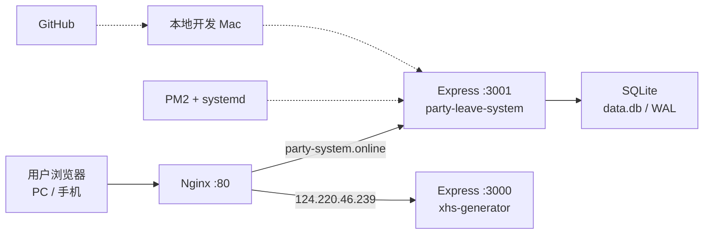

# 🏛 党员活动管理平台

一个轻量级全栈 Web 应用，用于党支部活动的报名管理、请假审批、成员统计和数据分析。

> 🔗 访问地址：[`http://party-system.online`](http://party-system.online) · [`http://124.220.46.239:3001`](http://124.220.46.239:3001)

---

## 功能总览

### 👤 访客端
| 功能 | 说明 |
|------|------|
| 活动列表 | 展示所有活动，未截止可报名，已截止灰显 |
| 报名表单 | 填写姓名 / 学号 / 电话，选择参加或请假 |
| 请假提交流程 | 必须选择请假事由 + 上传请假条（提供模版下载） |
| 截止拦截 | 超过截止时间自动禁止提交 |

### 🔐 管理端
| 功能 | 说明 |
|------|------|
| 管理总览 | 出勤率 / 请假率 / 缺勤率 + 各活动柱状图 + 总体饼图 |
| 活动管理 | 创建 / 编辑 / 删除活动，设置名称、日期、地点、截止时间 |
| 活动详情 | 查看参与记录，编辑状态（含请假条上传），批量新增成员，标记缺勤 |
| 成员统计 | 成员列表 + 筛选（全勤/请假/缺勤）+ 删除成员 + 出勤率进度条 |
| 成员详情 | 单人活动历史 + 请假类型饼图 + 编辑状态（学号/电话/请假条） |
| 数据导出 | Excel 导出（活动名单 / 成员汇总） |
| ZIP 打包 | 一键打包活动下所有请假单 |
| 密码修改 | 管理员修改登录密码 |

---

## 技术栈

| 层级 | 技术 |
|------|------|
| **前端** | React 18 · react-router-dom v6 · Recharts · xlsx · axios |
| **后端** | Express.js (Node.js) · better-sqlite3 · JWT · bcryptjs |
| **数据库** | SQLite (WAL 模式) |
| **文件上传** | Multer · archiver (ZIP) |
| **进程管理** | PM2 (systemd 开机自启) |
| **反向代理** | Nginx (域名路由) |
| **部署** | 腾讯云 Ubuntu 22.04 · 4C4G |

---

## 项目结构

```
party-leave-system/
├── client/                          # React 前端
│   ├── public/
│   │   ├── index.html               # HTML 模板 (viewport 响应式)
│   │   └── 请假单-模版.docx           # 用户下载的请假单模板
│   ├── src/
│   │   ├── context/AppContext.js     # 全局状态 + API 拦截器 + isMobile
│   │   ├── components/Layout.js      # 布局 (Header/Footer/移动端Tab导航)
│   │   └── pages/
│   │       ├── Home.js              # 访客首页 (活动列表)
│   │       ├── ActivityDetail.js    # 访客报名页 (表单+请假上传)
│   │       ├── AdminLogin.js        # 管理员登录
│   │       ├── AdminDashboard.js    # 管理总览 (率值卡片+图表)
│   │       ├── AdminActivities.js   # 活动管理 (CRUD表格)
│   │       ├── AdminActivityDetail.js # 活动详情 (记录管理+批量新增+状态编辑)
│   │       ├── MemberHistory.js     # 成员统计 (列表+筛选+删除)
│   │       ├── MemberDetail.js      # 成员详情 (饼图+活动历史+状态编辑)
│   │       └── AdminSettings.js     # 修改密码
│   └── package.json
├── server/
│   └── index.js                     # Express API 全部 20+ 路由
├── ecosystem.config.js              # PM2 生产环境配置
├── server-setup.bat                 # Windows 部署脚本
├── deploy.sh                        # Linux 自动部署脚本
└── .gitignore                       # 排除 node_modules/uploads/数据库/日志
```

---

## 数据库模型

| 表名 | 说明 | 关键字段 |
|------|------|----------|
| `admins` | 管理员 | id, username, password_hash |
| `activities` | 活动 | id(UUID), name, date, deadline, location |
| `members` | 成员 | id(UUID), name, student_id, phone |
| `participations` | 参与记录 | id, activity_id(FK), member_id(FK), will_attend, leave_reason, leave_file_path, is_absent |
| `leave_categories` | 请假事由分类 | id, name |

### 成员状态定义

| will_attend | is_absent | 状态 |
|:-----------:|:---------:|------|
| 1 | 0 | ✅ 参加 |
| 0 | 0 | 📝 请假 |
| 0/1 | 1 | ⚠️ 缺勤 (管理员标记，优先级最高) |

---

## 部署架构



---

## 部署历史

### 🪟 首次部署：Windows Server (49.232.215.76)
- 远程桌面 (RDP) 连接，拖拽 zip 包部署
- 遇到 better-sqlite3 编译问题 → 安装 VS Build Tools 2022 + MSVC
- package-lock.json 锁定内网 npm 源 → 删除后重装
- .bat 脚本中文乱码 → 全改用英文
- 防火墙服务被禁用 → 注册表启用

### 🐧 迁移至 Linux：Ubuntu 22.04 (124.220.46.239)
- `scp` + `ssh` 一键部署，10 分钟完成
- `apt install build-essential` 解决编译问题
- `ufw` 配置防火墙比 Windows 简单太多
- Nginx 反向代理，支持自定义域名

### 🌐 域名：`party-system.online`
- 腾讯云注册 · DNS A 记录 → `124.220.46.239`
- Nginx `server_name` 路由分发

---

## 开发环境

```bash
# 1. 安装依赖
cd server && npm install
cd ../client && npm install

# 2. 启动后端 (端口 3001)
cd server && node index.js

# 3. 启动前端 (端口 3000, 开发模式)
cd client && npm start

# 默认管理员: admin / 1234
```

## 生产构建

```bash
# 构建前端
cd client && npm run build

# Express 自动 serve client/build 静态文件
cd server && node index.js

# 或使用 PM2
pm2 start ecosystem.config.js
```

---

## API 接口 (20+)

| 方法 | 路径 | 认证 | 说明 |
|------|------|:----:|------|
| GET | `/api/activities` | — | 活动列表 |
| POST | `/api/activities` | JWT | 创建活动 |
| PUT | `/api/activities/:id` | JWT | 编辑活动 |
| DELETE | `/api/activities/:id` | JWT | 删除活动 |
| GET | `/api/activities/:id/stats` | JWT | 活动统计 |
| GET | `/api/activities/:id/participations` | JWT | 参与列表 |
| POST | `/api/activities/:id/participations/batch` | JWT | 批量新增 |
| GET | `/api/activities/:id/download-zip` | JWT | ZIP 下载 |
| POST | `/api/members` | — | 创建/查找成员 |
| PUT | `/api/members/:id` | JWT | 修改成员信息 |
| DELETE | `/api/admin/members/:id` | JWT | 删除成员(级联) |
| GET | `/api/admin/members` | JWT | 成员统计列表 |
| GET | `/api/admin/members/:id/detail` | JWT | 成员详情 |
| POST | `/api/participations` | — | 提交参与 |
| PUT | `/api/participations/:id` | JWT | 修改参与(含文件) |
| PATCH | `/api/participations/:id/toggle-absent` | JWT | 切换缺勤 |
| DELETE | `/api/participations/:id` | JWT | 删除参与 |
| GET | `/api/files/:filename` | JWT | 下载文件 |
| GET | `/api/categories` | — | 请假事由 |
| POST | `/api/auth/login` | — | 登录 |
| POST | `/api/auth/change-password` | JWT | 改密 |
| GET | `/api/admin/export` | JWT | Excel 导出 |

---

## 关键踩坑记录

| 问题 | 原因 | 解决 |
|------|------|------|
| `.bat` 脚本乱码 | Windows cmd 编码 | 全部用英文 |
| `npm install` 连不上 | `package-lock.json` 锁定内网源 | 删除 lock 文件 |
| `better-sqlite3` 编译失败 | 缺编译工具 | Win: VS Build Tools · Linux: `build-essential` |
| Node.js v24 不兼容 | 原生模块无预编译包 | 使用 v22 LTS |
| ZIP 下载报错 | archiver v8 ESM + 中文 header | v5 CJS + encodeURIComponent |
| 外网无法访问 | 安全组未关联 / 防火墙禁用 | 腾讯云安全组 + ufw / netsh |
| 三率和 ≠ 100% | Math.round 各自四舍五入 | 前两取整，第三 `100 - a - b` |
| Nginx 域名冲突 | 80 端口已有其他站点 | server_name 路由分发 |

---

## 维护命令 (服务器上)

```bash
pm2 status                          # 查看状态
pm2 logs party-leave-system         # 查看日志
pm2 restart party-leave-system      # 重启应用
sudo nginx -t && sudo nginx -s reload  # 重载 Nginx
sudo ufw status                     # 查看防火墙
```

## 更新部署 (从本机)

```bash
cd party-leave-system/client && npm run build
tar -czf /tmp/party-update.tar.gz client/build/
scp /tmp/party-update.tar.gz ubuntu@124.220.46.239:/tmp/
ssh ubuntu@124.220.46.239 "
  cd /opt/party-leave-system
  sudo rm -rf client/build
  sudo tar -xzf /tmp/party-update.tar.gz
  sudo chown -R ubuntu:ubuntu client/build
"
```

## 代码备份

```bash
git add -A && git commit -m "描述改动"
git push
```

> 📦 GitHub: [liuxuer12123-cmd/party-leave-system](https://github.com/liuxuer12123-cmd/party-leave-system)

---

*最后更新: 2025-07-25 · v1.1*